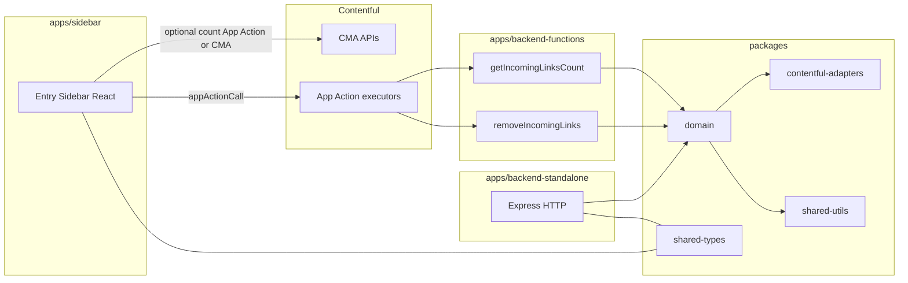

# Contentful Archive Helper

Production-oriented **full-stack Contentful app** for **heavily referenced entries**: fast **inbound link counts**, **batched unlink** (one batch per App Action invocation to avoid function timeouts), and shared **domain logic** used by the **sidebar**, **standalone HTTP API**, and **Contentful Functions**.

## Why two App Actions?

| Action | Role |
|--------|------|
| **`getIncomingLinksCount`** | Lightweight: `links_to_entry` with `limit: 1` and read **`total`**. Safe to run in Automations before any writes. |
| **`removeIncomingLinks`** | Heavy: fetches at most **`batchSize`** linking entries, strips references, updates entries, optional republish. **One batch per call** — repeat until **`hasMore === false`**. |

Splitting count and unlink keeps workflows fast and avoids exceeding **Contentful Function / App Action** time limits when thousands of entries link to one target.

## Why batched unlinking?

In large spaces, **one** invocation that scans and updates every inbound link can **timeout**. This app processes **at most `batchSize` (default 20, max 100)** linking entries per run and returns **`nextSkip`**, **`hasMore`**, and **`remainingEstimate`** so callers (sidebar, Automations, or custom code) can **loop** until done.

### Batch execution model

- **`skip`** — Offset into the CMA `links_to_entry` ordering for the target entry.
- **`batchSize`** — Maximum number of linking entries **requested from CMA** in this invocation (after clamping).
- **`nextSkip`** — `skip +` (number of items returned in the current CMA page). Advance to this value for the next call.
- **`hasMore`** — `true` if `nextSkip < totalLinkedEntries`.
- **`processedInThisBatch`** — Linking entries that matched **`contentTypeFilter`** (if any) and were evaluated for unlink.

### Intended automation flow

1. Call **`getIncomingLinksCount`** → decide if work is needed.  
2. Loop: call **`removeIncomingLinks`** with `skip` (start at `0`), then `nextSkip` from the previous result, until **`hasMore === false`**.  
3. Proceed with archive / delete when no inbound links remain.

**Programmatic helper** (scripts / custom servers, not inside a short-lived Function):

```typescript
import {
  runRemoveIncomingLinksUntilComplete,
  removeIncomingLinksActionHandler,
} from "@archive-helper/domain";

// executeBatch = (input) => removeIncomingLinksActionHandler(input, services.unlink, options);
const { rounds, final } = await runRemoveIncomingLinksUntilComplete(executeBatch, {
  spaceId,
  environmentId,
  targetEntryId,
  batchSize: 20,
});
```

### Batch size precedence

1. **Explicit** `batchSize` on the App Action / HTTP body (if valid, clamped to 1–100).  
2. **Installation** parameter `defaultUnlinkBatchSize` (Contentful Functions: `context.appInstallationParameters`).  
3. **Standalone server:** environment variable **`DEFAULT_UNLINK_BATCH_SIZE`**.  
4. Hardcoded fallback **`20`** (`DEFAULT_UNLINK_BATCH_SIZE` in `@archive-helper/shared-types`).

## How-to guides

| Guide | What it covers |
|--------|----------------|
| **[Backend (standalone)](docs/guides/backend.md)** | Express app, env vars, HTTP endpoints, tests |
| **[Sidebar](docs/guides/sidebar.md)** | Vite, `VITE_*`, instance parameters, App Actions |
| **[Configuration](docs/CONFIGURATION.md)** | App definition, both App Actions, Automations |

## Architecture



| Piece | Responsibility |
|--------|----------------|
| **`apps/sidebar`** | Count (App Action or CMA), **Preview batch** / **Remove one batch**, batch size UI, progress from `hasMore` / `nextSkip` |
| **`apps/backend-standalone`** | Express: `GET /linked-entry-count`, `POST /remove-incoming-links`, `POST /app-actions/remove-incoming-links` |
| **`apps/backend-functions`** | Thin handlers: **`getIncomingLinksCountAction`**, **`removeIncomingLinksAction`** |
| **`packages/domain`** | **`InboundReferenceService`**, **`RemoveIncomingLinksBatchService`**, validation, orchestration helper |
| **`packages/contentful-adapters`** | **`ContentRepository`** + **`CmaContentRepository`** (standalone + functions aliases) |
| **`packages/shared-utils`** | **`removeTargetReferencesDeep`**, link / Rich Text helpers |
| **`packages/shared-types`** | Types + **`schemas/`** (JSON Schema draft-04 for both App Actions; instance + installation parameters) |

## Repository layout

```
contentful-archive-helper/
  apps/
    backend-standalone/   # Express HTTP API
    backend-functions/    # Contentful Function sources (compiled to dist/)
    sidebar/              # Vite + React entry sidebar
  packages/
    domain/
    contentful-adapters/
    shared-types/
    shared-utils/
  docs/
  contentful-app-manifest.json
```

## Quick start

```bash
npm install
npm run build
npm test
```

- **Standalone backend:** `npm run dev:backend` — set `CONTENTFUL_MANAGEMENT_TOKEN`; optional `DEFAULT_UNLINK_BATCH_SIZE`.  
- **Sidebar:** `npm run dev:sidebar` — see [docs/guides/sidebar.md](docs/guides/sidebar.md).  
- **Upload Functions:** `npm run build:contentful` then `contentful-app-scripts upload` (see below).

## HTTP API (standalone backend)

| Method | Path | Purpose |
|--------|------|---------|
| `GET` | `/health` | Liveness |
| `GET` | `/linked-entry-count` | `GetIncomingLinksCountActionResult` (`spaceId`, `environmentId`, `entryId` query params) |
| `POST` | `/remove-incoming-links` | Body: `RemoveIncomingLinksInput` → **`RemoveIncomingLinksResult`** (one batch) |
| `POST` | `/app-actions/remove-incoming-links` | Body: `InvokeRemoveLinksBody` → same batched result |

## App Action contracts

Schemas live in **`packages/shared-types/schemas/`** (draft-04 for Contentful UI).

**`removeIncomingLinks` output** (`AppActionRemoveLinksOutput` = `RemoveIncomingLinksResult`): includes `targetEntryId`, `totalLinkedEntries`, `batchSizeUsed`, `skipUsed`, `processedInThisBatch`, `nextSkip`, `hasMore`, `remainingEstimate`, `changed`, `unchanged`, `failed`, `results`.

Types: **`@archive-helper/shared-types`**.

## Shared service usage (mandatory pattern)

```typescript
const countService = new InboundReferenceService(contentRepository, logger);
const countResult = await countService.getCount(input);

const unlinkService = new RemoveIncomingLinksBatchService(contentRepository, logger);
const unlinkResult = await unlinkService.execute(validatedRemoveInput);
```

Adapters resolve **`batchSize`** via **`validateRemoveIncomingLinksInput`** before calling **`execute`**.

## Contentful app bundle (root manifest + `build/`)

| File | Role |
|------|------|
| **`contentful-app-manifest.json`** | Two functions: **`getIncomingLinksCount`**, **`removeIncomingLinks`** → `apps/backend-functions/dist/*.js` |
| **`contentful.esbuild.config.cjs`** | Browser target + Node polyfills for the Functions runtime |

```bash
npm run build:contentful
```

This builds packages, the **sidebar** SPA, bundles **Functions** into `build/`, then copies **`index.html`** and **`assets/`** into `build/` (Contentful rejects uploads without a root `index.html`).

```bash
npx contentful-app-scripts --ci upload --bundle-dir ./build --organization-id <orgId> --definition-id <appDefinitionId> --token <CMA_token>
```

## Netlify

**`netlify.toml`**: publish **`apps/sidebar/build`**. Functions: **`netlify/functions`**. Do not point Netlify Functions at compiled backend output.

## Scripts (root)

| Script | Description |
|--------|-------------|
| `npm run build` | All workspaces |
| `npm run build:packages` | `shared-types`, `shared-utils`, `contentful-adapters`, `domain` |
| `npm run build:contentful` | Packages + Contentful Functions → **`build/`** |
| `npm test` | Vitest in packages + apps |
| `npm run dev:backend` | Standalone Express |
| `npm run dev:sidebar` | Sidebar Vite |

## License

Use and adapt per your organization’s policies.
