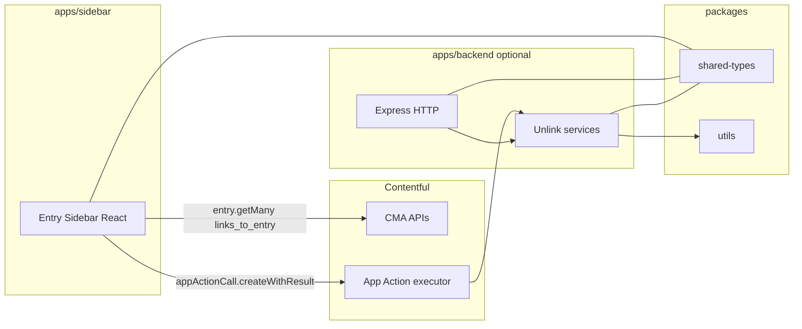

# Contentful Archive Helper

Production-oriented **full-stack Contentful app** to safely work with heavily referenced (“popular”) entries: show **inbound link counts** in the **entry sidebar**, run **dry-run / execute unlink** via an **App Action**, and reuse the same logic from **Automations**.

## How-to guides

| Guide | What it covers |
|--------|----------------|
| **[Backend](docs/guides/backend.md)** | Env vars, `npm run dev` / `start`, HTTP endpoints with `curl` examples, library usage, tests, troubleshooting |
| **[Sidebar](docs/guides/sidebar.md)** | Vite dev server, `VITE_*` and instance parameters, hosting the `build/`, `EntrySidebar` behavior, App Action contract, troubleshooting |
| **[Configuration](docs/CONFIGURATION.md)** | End-to-end wiring: Contentful app, App Actions, Automations, security |

## Architecture



| Piece | Responsibility |
|--------|------------------|
| **`apps/sidebar`** | React + App SDK + Forma 36, `LOCATION_ENTRY_SIDEBAR`: load **count** with `sdk.cma.entry.getMany({ query: { links_to_entry, limit: 1 } })`, **preview/execute** with `sdk.cma.appActionCall.createWithResult` |
| **`apps/backend`** | TypeScript services: inbound count, recursive unlink, optional **Express** routes; **`removeIncomingLinksAppAction`** maps to the App Action response contract |
| **`packages/shared-types`** | Contracts + **`schemas/`** (JSON Schema draft-04 for App Action; instance-parameter JSON for sidebar). Types: `ArchiveHelperInstanceParameters`, `AppActionRemoveLinksInput` / `AppActionRemoveLinksOutput`, etc. |
| **`packages/utils`** | Generic recursive unlink (`removeTargetReferencesDeep`) + link/Rich Text detection — **no hardcoded field names** |

## Capability review (vs product goals)

| Goal | Where it’s implemented |
|------|-------------------------|
| Incoming link count in entry sidebar | `EntrySidebar.tsx` → `sdk.cma.entry.getMany` + `total` |
| Button: preview unlink (dry run) | `EntrySidebar.tsx` → App Action with `dryRun: true` |
| Button: remove links | `EntrySidebar.tsx` → App Action with `dryRun: false`, `publishStrategy: "republish-if-published"` |
| Same unlink for Automations | Register App Action; executor runs `removeIncomingLinksAppAction` or HTTP `POST /app-actions/remove-incoming-links` |
| Shared contracts | `packages/shared-types` imported by sidebar + backend |
| Tests | `packages/utils` (recursive removal), `apps/backend` (services, handlers, action validation) |

## Repository layout

```
contentful-archive-helper/
  apps/
    backend/          # Node API + unlink engine
    sidebar/          # Vite + React sidebar UI
  packages/
    shared-types/     # Shared types + schemas/ (JSON Schema for App Action; instance params)
    utils/            # Recursive unlink utilities
  docs/
    CONFIGURATION.md      # End-to-end wiring (apps, actions, automations)
    guides/
      backend.md          # Backend how-to
      sidebar.md          # Sidebar how-to
```

> **Note:** The earlier standalone folder `contentful-unlink-backend` is superseded by `apps/backend` + packages in this monorepo.

## Quick start

```bash
npm install
npm run build
npm test
```

- **Backend dev:** `npm run dev -w @archive-helper/backend` (set `apps/backend/.env`).
- **Sidebar dev:** `npm run dev -w @archive-helper/sidebar` — details in [docs/guides/sidebar.md](docs/guides/sidebar.md).

## HTTP API (backend)

When running `apps/backend`, useful routes include:

| Method | Path | Purpose |
|--------|------|---------|
| `GET` | `/health` | Liveness |
| `GET` | `/linked-entry-count` | Count + optional preview (token auth via env for server-side callers) |
| `POST` | `/remove-incoming-links` | Full `RemoveIncomingLinksResult` including `targetEntryId` |
| `POST` | `/app-actions/remove-incoming-links` | Body: `InvokeRemoveLinksBody` → **`AppActionRemoveLinksOutput`** (for webhook-style executors) |

## App Action contract

**Input parameters** (sidebar + Automations):

- `targetEntryId` (string, required)
- `dryRun` (boolean, optional)
- `publishStrategy` (`"none"` \| `"republish-if-published"`, optional)

**Output** (`AppActionRemoveLinksOutput`):

- `totalLinkedEntries`, `scanned`, `changed`, `unchanged`, `failed`, `results: EntryUnlinkResult[]`

Types live in **`@archive-helper/shared-types`**.

## Configuration (detailed)

Step-by-step component guides: **[Backend](./docs/guides/backend.md)** · **[Sidebar](./docs/guides/sidebar.md)**.

See **[docs/CONFIGURATION.md](./docs/CONFIGURATION.md)** for:

- How the **sidebar** talks to CMA vs App Actions  
- How to **register the app** and **Entry sidebar** location  
- How to **register the App Action** and wire **Automations**  
- **Environment variables** and **local development**  
- **Security** notes  

## Scripts (root)

| Script | Description |
|--------|-------------|
| `npm run build` | Build all workspaces |
| `npm run build:packages` | `shared-types` + `utils` only |
| `npm test` | Utils + backend tests |
| `npm run dev:backend` | Backend dev server |
| `npm run dev:sidebar` | Sidebar Vite dev server |

## License

Use and adapt per your organization’s policies.
